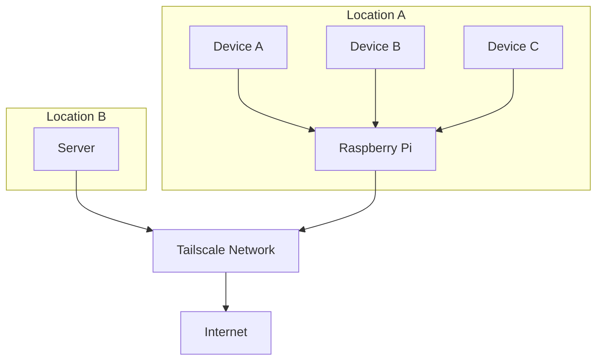

# VPN Hotspot

Create a Wi-Fi hotspot using a Raspberry Pi that's already connected to your Tailscale network. Your connected devices can access the VPN without needing a client installed.


## Table of Contents

1. [Why This Project?](#why-this-project)  
2. [Features](#features)  
3. [How It Works](#how-it-works)  
4. [Requirements](#requirements)  
5. [Setup](#setup)  
6. [Contributing](#contributing)  
7. [License](#license)

---

## 💡 Why This Project?

This project is for anyone who wants to provide VPN access to devices that can't run a VPN client natively. A common use case is a Wi-Fi only device (like a smart TV or game console) that needs to route its traffic through a VPN for privacy and security. By turning a Raspberry Pi into a VPN-connected hotspot, any device that joins it will automatically be on your Tailscale (or other) VPN network.

## ✨ Features

*   **Effortless VPN access:** Simply connect to the Wi-Fi hotspot to route traffic through the VPN.
*   **No client software required** on connected devices.
*   **Works with Tailscale**, and the concepts are extensible to other VPNs.
*   **Built on Raspberry Pi** and optimized for a lean Ubuntu Server environment.

## 🗺️ How It Works

The Raspberry Pi acts as a gateway, forwarding all traffic from the Wi-Fi interface (`wlan0`) to the VPN interface (`tailscale0`). This is accomplished using `netplan` for network configuration and IP forwarding to route packets between the two networks.



## 📋 Requirements

*  **Hardware:** Raspberry Pi (any model with a Wi-Fi interface)
*  **OS:** Ubuntu Server (latest LTS release recommended)
*  **VPN:** An active Tailscale account is needed.

## 🚀 Setup

1. Flash Ubuntu Server to your Raspberry Pi and boot it up.  
2. Clone this repository to your Pi:

   ```bash
   git clone https://github.com/maddyb99/vpn-hotspot.git
   cd vpn-hotspot
   ```
3. Make the setup scripts executable:

   ```bash
   chmod +x hotspot.sh vpn.sh
   ```
4. **[OPTIONAL]** Open and edit the netplan.yaml file. Set your desired SSID, password, etc.
5. Run the setup scripts in sequence:
   ```bash
   sudo ./hotspot.sh
   sudo ./vpn.sh
   ```
  * hotspot.sh: Sets up Wi-Fi AP mode, configures NetworkManager and ipv4 sharing.
  * vpn.sh: Ensures VPN connectivity and applies firewall/nat rules.

## 🤝 Contributing
Contributions, issues, and feature requests are welcome! Feel free to check the issues page.

## 📄 License

Distributed under the GNU GENERAL PUBLIC LICENSE v3.0
—see the LICENSE file for more details.
